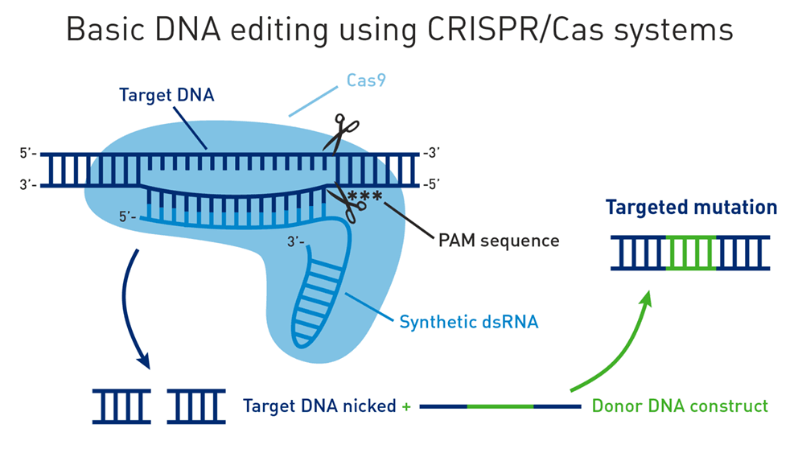
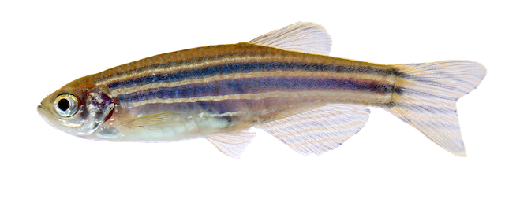
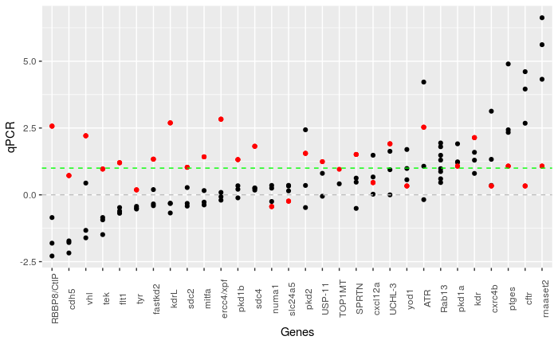

# Data-Analytics-Project
## Project DW1: Visual analytics for guiding gene editing

### Our goals

1. We want to understand the mechanisms that affect success of gene editing in zebrafish
2. We want to use this knowledge to predict what will make future experiments successful
3. We want to display our findings in an easy to use web framework that biologists can use

### Background

* CRISPR-Cas9 is a gene editing method that causes genes (functional units of DNA) to be 'knocked out' or stop working. 

* Editing a genes function has implications in study of genomic medicine and the pharmaceutical industries. 

* It works by using a piece of guide RNA to recruit an enzyme that cuts the DNA at a targeted point, near the gene we want to stop working. 

* Currently, The guide RNA is designed by the biologist (often using a tool such as chopchop) and is a specific match for the DNA we are targeting. However, if we can define what makes a guide and therefore gene editing successful we can refine this process.

### Model organism

* For this study we are working on the zebrafish (Danio rerio)
* Model organisms are non-human species that are used in the laboratory to help scientists understand biological processes.
* The **genome assembly** of the zebrafish we are using is **GRCz11 (danRer11)**. This refers to the version of the reference genome that we are using to map different features. If we use a different assembly the genomic coordinates will be different and the results inaccurate.

### The data
The data we receive from the collaborator is data/danrer11-guides.txt. The column headings are :

* ID - a simple ID given to each guide designed
* GENE_NAME - The name of the gene to be edited
* GENE_ID - The ensembl ID of the gene to be edited (often more useful)
* GUIDE - the DNA sequence of the guide
* qPCR - the measure of gene editing success from the lab. They are measuring how well the target gene has stopped being expressed (stopped working). A score >1 is considered good.
* POOL - a pooled result score. This can be ignored
* CONTROL - The positive control score. This gives a measure of whether the experiment is working (regardless of gene knockdown). We should only consider results where the control score is >0 or else we may have false positives.

This plot shows a representation of the qPCR scores (black) and CONTROL scores (red). You will notice most genes have at least 3 guides. Why did some guides work better than others for the same gene?

The file /data/guides_coordinates_danrer11.bed contains the guide IDS with the **genomic coordinates** of that particular guide (should be in very close proximity to the target gene). Genomic coordinates are in the format **CHROMOSOME START END** for example chr2 12345 12567 or chr2:12345-12567 or even 2:12345-12567. This lets you know what chromosome (DNA structure) it is located on and the start and end coordinates within that chromosome. The zebrafish has 25 chromosomes, more information can be found here https://www.ncbi.nlm.nih.gov/grc/zebrafish/data.

### Feature data
Features that may give us useful insights to guide success

* GC content how many of the guides bases (letters) are G or C?
* Distance of guide to coordinates of gene start (TSS) 
    + We have TSS coordinates in /data/dominant-TSS-danrer11.txt columns BATCH and ANTICAGE give TSS coordinates from two slightly differing methods
* Expression level of target gene (measure of how much gene product is made)
    + /data/ebi-expression-atlas-danio-rerio.txt
* Whether guide is self complementary (does it fold up on itself)
    + algorithms available within chopchop (or other tools)
* Chromatin composition (structure of the DNA - is it open and accessible or tightly folded)
* Does the guide have off targets -  does it map to other DNA coordinates

### Useful papers and resources
CRISPRscan: designing highly efficient sgRNAs for CRISPR-Cas9 targeting in vivo Moreno-Mateos et al 2015
https://www.nature.com/articles/nmeth.3543
This paper analysed the stability of 1000 CRISPR guides by sequencing several hours after initial injection into zebrafish. Then then analysed genomic features that influenced guide stability. On this basis they make a predictive scoring algorithm and interactive interface CRISPRscan -
https://www.crisprscan.org/

Computational approaches for effective CRISPR guide RNA design and evaluation Lie et al 2020
https://www.ncbi.nlm.nih.gov/pmc/articles/PMC6921152/
A recent review detailing the efficiency problems with gene editing experiments and current computational approaches.

CHOPCHOP v3: expanding the CRISPR web toolbox beyond genome editing. Labun et ak 2019
https://academic.oup.com/nar/article/47/W1/W171/5491735
This paper details the chopchop web interface that uses algorithms to predict target sites for gene editing
https://chopchop.cbu.uib.no/
https://bitbucket.org/valenlab/chopchop/src/master/

More tools

http://cistrome.org/crispr/

http://crispor.tefor.net/

### Additional lab data
The lab are currently designing new guides and repeating old ones. Hopefully they will be generating additional data soon. 
